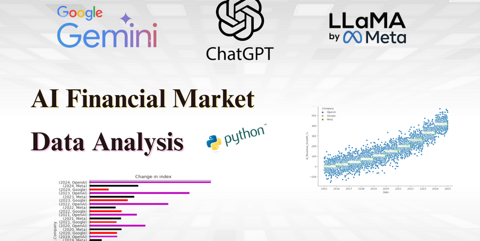

# AI_Financial_Market_Data_Analytics

### This project aims to analyze the stocks of the 3 largest companies involved in Artificial Intelligence - Google, Meta, and OpenAI, investigating the impact of various tool launch events on their listed stocks in the financial market.

- Dataset Link: https://www.kaggle.com/datasets/rohitgrewal/ai-financial-and-market-data/data

  

### SQL queries were created to demonstrate knowledge of the language, along with dashboards built in Power BI.
